<div align="center">

<a href="https://cacg-code.github.io/chatbots-whatsapp-desde-cero/">
  
</a>

<a href="https://cacg-code.github.io/chatbots-whatsapp-desde-cero/"></a>

<br>


**Aprende a construir un bot de WhatsApp real, de la idea al despliegue, sin saber nada de bots.**
Se abre en el navegador, con ejercicios que se corrigen solos, simulador de chat y progreso guardado.


<br>

[**Entrar al curso**](https://cacg-code.github.io/chatbots-whatsapp-desde-cero/) · [**Probar el simulador**](https://cacg-code.github.io/chatbots-whatsapp-desde-cero/simulador/)

</div>

<p align="center">
  <a href="#-simulador-de-whatsapp"><b>Simulador</b></a> ·
  <a href="#-qué-vas-a-construir"><b>Qué construirás</b></a> ·
  <a href="#️-tu-ruta-y-temario"><b>Ruta</b></a> ·
  <a href="#-antes-de-empezar"><b>Requisitos</b></a> ·
  <a href="#-código-de-referencia"><b>Código</b></a> ·
  <a href="#️-aviso-importante"><b>Aviso</b></a>
</p>

## 💬 Simulador de WhatsApp

<div align="center">


</div>

Un WhatsApp de práctica que corre en tu navegador con el mismo motor del bot del curso: sin cuenta de Meta, sin internet y sin costo.

- **Guía interactiva** de 6 pasos la primera vez que lo abres (o con «¿Cómo se usa?»).
- **Guiones automáticos**: pedido completo, cierre de la ventana de 24 h y mensaje que el bot no entiende.
- **Panel JSON** con lo que entra y sale del motor, y reloj simulado para probar la ventana de 24 h.
- Es opcional: el curso también se sigue con la terminal (`consola.js`).

## 🛒 Qué vas a construir

<div align="center">


</div>

Un bot para un negocio ficticio, **Minimarket La Esquina**: muestra el catálogo, arma el carrito, toma el pedido (recojo o delivery, Yape o efectivo), guarda la sesión de cada cliente, avisa al dueño, envía recordatorios con plantillas y pasa a una persona cuando hace falta. La misma base sirve para citas, pedidos o preguntas frecuentes de cualquier negocio.

<div align="center">


</div>

## 🗺️ Tu ruta y temario

<div align="center">




</div>

<details>
<summary><b>Ver el temario completo en tabla (28 lecciones)</b></summary>

| Módulo | Lecciones |
|---|---|
| Fundamentos | 1 Cómo funciona un bot · 2 Diseñar la conversación |
| Herramientas | 3 JavaScript y Node · 4 Primer bot en consola |
| Motor de reglas | 5 Estado · 6 Texto libre · 7 Catálogo y carrito · 8 Flujo de pedido |
| Servidor y webhook | 9 Webhooks y JSON · 10 Servidor del bot · 11 Despliegue en Cloudflare |
| Conectar con WhatsApp | 12 Cuenta y app de Meta · 13 Recibir mensajes · 14 Enviar mensajes · 27 Práctica con Telegram · 28 Otros proveedores |
| Memoria y datos | 15 Memoria con KV · 16 Panel con Google Sheets |
| Plantillas y automatización | 17 Plantillas · 18 Recordatorios · 19 WhatsApp Flows |
| Marketing y costos | 20 Marketing responsable · 21 Costos y métricas |
| Inteligencia artificial | 22 IA como complemento |
| Producción y negocio | 23 Pruebas y errores · 24 Seguridad · 25 Atención humana · 26 Vender tu bot |
| Proyecto final | El bot completo del minimarket |

</details>

## ✅ Antes de empezar

<div align="center">


</div>

Necesitas lo básico de JavaScript. Si vienes de cero, haz primero [Desarrollo web desde cero](https://cacg-code.github.io/web-desde-cero/) (JavaScript y Node.js). Más trabajos del autor en el [portafolio Carlo · Dev](https://cacg-code.github.io/).

## 🧪 Código de referencia

<div align="center">


</div>

La carpeta [`codigo/`](codigo/) contiene el bot terminado, con 113 pruebas (`npm test`) y una consola para conversar con él (`node consola.js`). Las lecciones se escriben contra ese código real.

```bash
cd codigo
npm install
npm test
node consola.js
```

## 🔧 Cómo está hecho

<div align="center">


</div>

Las lecciones son Markdown en `contenido/`; `python scripts/construir.py` genera el sitio estático y `node scripts/probar-ejercicios.mjs` comprueba que cada ejercicio tiene una solución válida. `python scripts/revisar.py` valida enlaces, sitemap y accesibilidad básica.

## ⚠️ Aviso importante

<div align="center">


</div>

Los datos de Meta (precios, límites, menús, versión de la API) cambian. Las lecciones lo marcan con «Verifica este dato» y enlazan a la documentación oficial. Este curso no está afiliado a Meta ni a WhatsApp.

## 🙋 Acerca de este material

Lo hace **un estudiante** con ayuda de inteligencia artificial, como aporte gratuito a la comunidad de desarrolladores. No es un curso oficial, no da títulos ni certificados y puede tener errores, sobre todo en datos que Meta cambia (precios, límites, menús). Contrástalo con la [documentación oficial de WhatsApp Business Platform](https://developers.facebook.com/docs/whatsapp/) y avísame de cualquier fallo en los [issues](https://github.com/Cacg-code/chatbots-whatsapp-desde-cero/issues/new).

📝 Lee también [lo que aprendí construyendo esto](https://cacg-code.github.io/chatbots-whatsapp-desde-cero/aprendizajes/): decisiones, errores reales y qué haría distinto.

## 📄 Licencia

<div align="center">


</div>

Código bajo [MIT](LICENSE); contenido bajo [LICENSE-CONTENIDO.md](LICENSE-CONTENIDO.md). Normas de convivencia en [CODE_OF_CONDUCT.md](CODE_OF_CONDUCT.md).

<div align="center">

<a href="https://github.com/Cacg-code/chatbots-whatsapp-desde-cero/issues/new"></a>

</div>
