<div align="center">

<a href="https://cacg-code.github.io/chatbots-whatsapp-desde-cero/">
  
</a>

<a href="https://cacg-code.github.io/chatbots-whatsapp-desde-cero/"></a>

<br>


**Aprende a construir un bot de WhatsApp real, de la idea al despliegue, sin saber nada de bots.**
Se abre en el navegador, con ejercicios que se corrigen solos, simulador de chat y progreso guardado.


<br>

[**Entrar al curso**](https://cacg-code.github.io/chatbots-whatsapp-desde-cero/) · [**Probar el simulador**](https://cacg-code.github.io/chatbots-whatsapp-desde-cero/simulador/)

</div>

<p align="center">
  <a href="#-simulador-de-whatsapp"><b>Simulador</b></a> ·
  <a href="#-qué-vas-a-construir"><b>Qué construirás</b></a> ·
  <a href="#️-tu-ruta-y-temario"><b>Ruta</b></a> ·
  <a href="#-antes-de-empezar"><b>Requisitos</b></a> ·
  <a href="#-código-de-referencia"><b>Código</b></a> ·
  <a href="#️-aviso-importante"><b>Aviso</b></a>
</p>

## 💬 Simulador de WhatsApp

<div align="center">



</div>

Un WhatsApp de práctica que corre en tu navegador con el mismo motor del bot del curso: sin cuenta de Meta, sin internet y sin costo.

- **Guía interactiva** de 6 pasos la primera vez que lo abres (o con «¿Cómo se usa?»).
- **Guiones automáticos**: pedido completo, cierre de la ventana de 24 h y mensaje que el bot no entiende.
- **Panel JSON** con lo que entra y sale del motor, y reloj simulado para probar la ventana de 24 h.
- Es opcional: el curso también se sigue con la terminal (`consola.js`).

## 🛒 Qué vas a construir

<div align="center">



</div>

Un bot para un negocio ficticio, **Minimarket La Esquina**: muestra el catálogo, arma el carrito, toma el pedido (recojo o delivery, Yape o efectivo), guarda la sesión de cada cliente, avisa al dueño, envía recordatorios con plantillas y pasa a una persona cuando hace falta. La misma base sirve para citas, pedidos o preguntas frecuentes de cualquier negocio.

<div align="center">

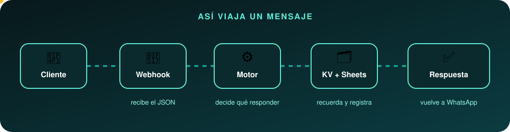

</div>

## 🗺️ Tu ruta y temario

<div align="center">


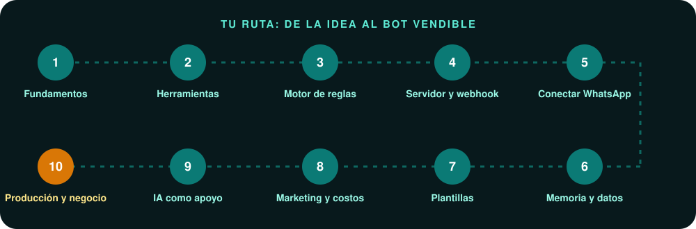

<p align="center">
<a href="https://cacg-code.github.io/chatbots-whatsapp-desde-cero/01-como-funciona-un-bot/">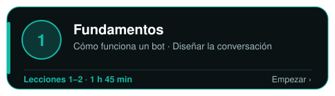</a>
<a href="https://cacg-code.github.io/chatbots-whatsapp-desde-cero/03-javascript-y-node-para-bots/">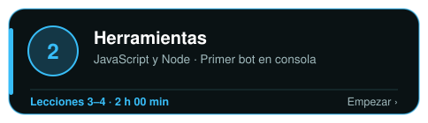</a>
</p>

<p align="center">
<a href="https://cacg-code.github.io/chatbots-whatsapp-desde-cero/05-estado-de-la-conversacion/">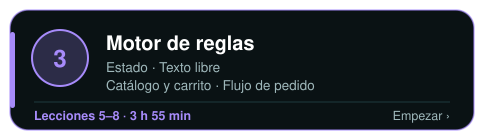</a>
<a href="https://cacg-code.github.io/chatbots-whatsapp-desde-cero/09-webhooks-y-json-de-whatsapp/">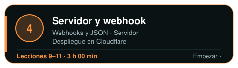</a>
</p>

<p align="center">
<a href="https://cacg-code.github.io/chatbots-whatsapp-desde-cero/12-cuenta-y-app-de-meta/">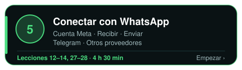</a>
<a href="https://cacg-code.github.io/chatbots-whatsapp-desde-cero/15-memoria-con-kv/">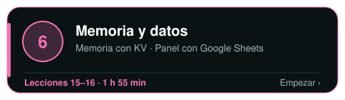</a>
</p>

<p align="center">
<a href="https://cacg-code.github.io/chatbots-whatsapp-desde-cero/17-plantillas/">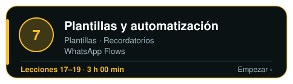</a>
<a href="https://cacg-code.github.io/chatbots-whatsapp-desde-cero/20-marketing-responsable/">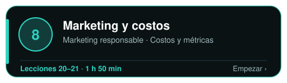</a>
</p>

<p align="center">
<a href="https://cacg-code.github.io/chatbots-whatsapp-desde-cero/22-ia-como-complemento/">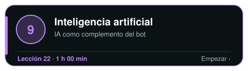</a>
<a href="https://cacg-code.github.io/chatbots-whatsapp-desde-cero/23-pruebas-y-errores/">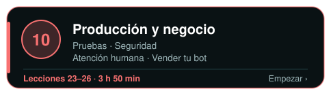</a>
</p>

<p align="center"><a href="https://cacg-code.github.io/chatbots-whatsapp-desde-cero/proyecto-bot-minimarket/"></a></p>

<sub>Toca un módulo para abrir su primera lección · la tabla de abajo enlaza cada lección.</sub>

</div>

<details>
<summary><b>📚 Ver el temario con enlace a cada lección (28 lecciones ≈ 27 h + proyecto final)</b></summary>

<br>

🟢 Básico · 🟡 Intermedio · 🔴 Avanzado &nbsp;·&nbsp; el tiempo es una estimación por lección.

#### 🧭 Módulo 1 · Fundamentos &nbsp;<sub>⏱ 1 h 45 min</sub>

<sup>Qué es un bot de WhatsApp, qué puede hacer y cómo se diseña antes de programarlo.</sup>

| Nº | Lección | Qué aprenderás | Nivel | Tiempo |
|:-:|---|---|:-:|--:|
| **1** | [**Cómo funciona un bot de WhatsApp**](https://cacg-code.github.io/chatbots-whatsapp-desde-cero/01-como-funciona-un-bot/) | Qué es un bot de WhatsApp, qué piezas lo forman, qué diferencia a la API oficial de las apps no oficiales y qué reglas impone Meta. | 🟢 Básico | 50 min |
| **2** | [**Diseñar la conversación antes de programar**](https://cacg-code.github.io/chatbots-whatsapp-desde-cero/02-disenar-la-conversacion/) | Define qué hará y qué no hará tu bot, su tono, sus flujos y estados, los límites de los mensajes interactivos y cómo pasar a una persona. | 🟢 Básico | 55 min |

#### 🧰 Módulo 2 · Herramientas &nbsp;<sub>⏱ 2 h 00 min</sub>

<sup>Lo mínimo de JavaScript y Node para construir un bot, y tu primer bot en la terminal.</sup>

| Nº | Lección | Qué aprenderás | Nivel | Tiempo |
|:-:|---|---|:-:|--:|
| **3** | [**JavaScript y Node.js para bots**](https://cacg-code.github.io/chatbots-whatsapp-desde-cero/03-javascript-y-node-para-bots/) | Instala Node, aprende a usar la terminal y repasa solo el JavaScript que necesita un bot: arrays, funciones puras, async/await, JSON, fetch y pruebas. | 🟢 Básico | 60 min |
| **4** | [**Tu primer bot en la consola**](https://cacg-code.github.io/chatbots-whatsapp-desde-cero/04-primer-bot-en-consola/) | Construye un bot funcional en la terminal con readline, separa el cerebro de la entrada y salida, y escribe su primera prueba automática. | 🟢 Básico | 60 min |

#### ⚙️ Módulo 3 · Motor de reglas &nbsp;<sub>⏱ 3 h 55 min</sub>

<sup>El cerebro del bot: estado, texto libre, catálogo, carrito y pedido completo.</sup>

| Nº | Lección | Qué aprenderás | Nivel | Tiempo |
|:-:|---|---|:-:|--:|
| **5** | [**El estado de la conversación**](https://cacg-code.github.io/chatbots-whatsapp-desde-cero/05-estado-de-la-conversacion/) | Cómo un bot recuerda en qué punto va cada cliente con una sesión y una máquina de estados, y por qué su cerebro debe ser una función pura. | 🟡 Intermedio | 55 min |
| **6** | [**Entender texto libre**](https://cacg-code.github.io/chatbots-whatsapp-desde-cero/06-entender-texto-libre/) | Cómo un bot de reglas entiende frases como «quiero dos leches» con normalización, cantidades, sinónimos, tolerancia a errores de tipeo e intenciones, sin usar IA. | 🟡 Intermedio | 60 min |
| **7** | [**Catálogo y carrito**](https://cacg-code.github.io/chatbots-whatsapp-desde-cero/07-catalogo-y-carrito/) | Modela el catálogo del minimarket como datos, respeta los límites de botones y listas de WhatsApp y construye un carrito puro e inmutable que suma en céntimos. | 🟡 Intermedio | 60 min |
| **8** | [**Flujo de pedido**](https://cacg-code.github.io/chatbots-whatsapp-desde-cero/08-flujo-de-pedido/) | Cierra el pedido de punta a punta, con entrega o recojo, mínimo de delivery, dirección, pago y confirmación, y aprende a probar todo el recorrido. | 🟡 Intermedio | 60 min |

#### 🌐 Módulo 4 · Servidor y webhook &nbsp;<sub>⏱ 3 h 00 min</sub>

<sup>Pasar de la terminal a un servidor que recibe mensajes por HTTP y vive en la nube.</sup>

| Nº | Lección | Qué aprenderás | Nivel | Tiempo |
|:-:|---|---|:-:|--:|
| **9** | [**Webhooks y JSON de WhatsApp**](https://cacg-code.github.io/chatbots-whatsapp-desde-cero/09-webhooks-y-json-de-whatsapp/) | Cómo Meta te entrega los mensajes: forma del JSON, parser que lo convierte en eventos simples, verificación GET del webhook y firma HMAC-SHA256. | 🟡 Intermedio | 60 min |
| **10** | [**El servidor del bot**](https://cacg-code.github.io/chatbots-whatsapp-desde-cero/10-servidor-del-bot/) | Cómo un Cloudflare Worker une webhook, motor y KV: rutas, firma, idempotencia, respuesta rápida con ctx.waitUntil y pruebas locales con wrangler dev. | 🟡 Intermedio | 65 min |
| **11** | [**Despliegue en Cloudflare**](https://cacg-code.github.io/chatbots-whatsapp-desde-cero/11-despliegue-en-cloudflare/) | Publicar el bot en Cloudflare Workers paso a paso: cuenta, Wrangler, KV, secretos, wrangler.toml, dry-run, deploy, logs con tail y cómo volver atrás. | 🟡 Intermedio | 55 min |

#### 💬 Módulo 5 · Conectar con WhatsApp &nbsp;<sub>⏱ 4 h 30 min</sub>

<sup>Cuenta de Meta, número, tokens, recibir mensajes reales y enviar texto, botones y listas.</sup>

| Nº | Lección | Qué aprenderás | Nivel | Tiempo |
|:-:|---|---|:-:|--:|
| **12** | [**Cuenta y app de Meta**](https://cacg-code.github.io/chatbots-whatsapp-desde-cero/12-cuenta-y-app-de-meta/) | Crea tu cuenta de desarrollador, la app de negocio, la cuenta de WhatsApp Business y el número de prueba, y entiende qué token usar y cuál guardar. | 🟡 Intermedio | 55 min |
| **13** | [**Recibir mensajes reales**](https://cacg-code.github.io/chatbots-whatsapp-desde-cero/13-recibir-mensajes-reales/) | Conecta el webhook de tu Worker con Meta, verifica la URL, suscríbete al campo de mensajes y mira llegar un mensaje real de tu celular. | 🟡 Intermedio | 55 min |
| **14** | [**Enviar mensajes**](https://cacg-code.github.io/chatbots-whatsapp-desde-cero/14-enviar-mensajes/) | Envía texto, botones y listas con la Graph API usando las funciones del código del curso, respeta los límites de WhatsApp y diagnostica los errores comunes. | 🟡 Intermedio | 55 min |
| **27** | [**Practica con Telegram sin cuenta de Meta**](https://cacg-code.github.io/chatbots-whatsapp-desde-cero/27-practica-con-telegram/) | Conecta el mismo motor de reglas a un bot de Telegram para practicar webhooks, botones y sesiones sin esperar aprobaciones de Meta ni gastar un sol. | 🟡 Intermedio | 55 min |
| **28** | [**Otros proveedores y alternativas a la API directa**](https://cacg-code.github.io/chatbots-whatsapp-desde-cero/28-otros-proveedores/) | Compara la Cloud API directa de Meta con proveedores como Twilio y 360dialog y con librerías no oficiales, para elegir con criterio y sin riesgos para el negocio. | 🟡 Intermedio | 50 min |

#### 🗄️ Módulo 6 · Memoria y datos &nbsp;<sub>⏱ 1 h 55 min</sub>

<sup>Guardar sesiones y pedidos, y darle al dueño un panel con Google Sheets.</sup>

| Nº | Lección | Qué aprenderás | Nivel | Tiempo |
|:-:|---|---|:-:|--:|
| **15** | [**Memoria con Cloudflare KV**](https://cacg-code.github.io/chatbots-whatsapp-desde-cero/15-memoria-con-kv/) | Guarda sesiones, pedidos e ids de mensajes en Cloudflare KV con vencimiento automático (TTL) y aprende sus límites reales para no perder datos. | 🟡 Intermedio | 55 min |
| **16** | [**Panel del dueño con Google Sheets**](https://cacg-code.github.io/chatbots-whatsapp-desde-cero/16-panel-con-google-sheets/) | Guarda cada pedido del bot como una fila en Google Sheets mediante una aplicación web de Apps Script protegida con secreto, y arma un panel sencillo para el dueño. | 🟡 Intermedio | 60 min |

#### 📨 Módulo 7 · Plantillas y automatización &nbsp;<sub>⏱ 3 h 00 min</sub>

<sup>Escribir primero: plantillas aprobadas, recordatorios programados y formularios con Flows.</sup>

| Nº | Lección | Qué aprenderás | Nivel | Tiempo |
|:-:|---|---|:-:|--:|
| **17** | [**Plantillas de mensaje**](https://cacg-code.github.io/chatbots-whatsapp-desde-cero/17-plantillas/) | Crea plantillas de WhatsApp, entiende sus categorías y su aprobación, envíalas con variables y botones de respuesta rápida usando whatsapp.js, y recibe lo que el cliente toca. | 🟡 Intermedio | 60 min |
| **18** | [**Recordatorios y seguimiento automático**](https://cacg-code.github.io/chatbots-whatsapp-desde-cero/18-recordatorios-y-seguimiento/) | Cómo enviar avisos útiles a tiempo con un cron, elegir entre texto libre y plantilla según la ventana de 24 horas, y respetar la baja del cliente. | 🟡 Intermedio | 60 min |
| **19** | [**Formularios dentro de WhatsApp con Flows**](https://cacg-code.github.io/chatbots-whatsapp-desde-cero/19-whatsapp-flows/) | Qué son los WhatsApp Flows, cómo es su JSON, cómo se envían y se leen sus respuestas, cuándo hace falta un endpoint y cuándo bastan botones. | 🔴 Avanzado | 60 min |

#### 📊 Módulo 8 · Marketing y costos &nbsp;<sub>⏱ 1 h 50 min</sub>

<sup>Promociones sin spam, permisos de los clientes y cuánto cuesta cada mensaje.</sup>

| Nº | Lección | Qué aprenderás | Nivel | Tiempo |
|:-:|---|---|:-:|--:|
| **20** | [**Marketing responsable por WhatsApp**](https://cacg-code.github.io/chatbots-whatsapp-desde-cero/20-marketing-responsable/) | Cómo conseguir y registrar el permiso de tus clientes, respetar la baja al instante, enviar promociones útiles y cuidar la calidad de tu número para no ser limitado. | 🟡 Intermedio | 55 min |
| **21** | [**Costos y métricas de tu bot**](https://cacg-code.github.io/chatbots-whatsapp-desde-cero/21-costos-y-metricas/) | Cómo cobra Meta cada mensaje, cuánto cuesta realmente un bot pequeño con su infraestructura y qué métricas registrar para saber si el bot le sirve al negocio. | 🟡 Intermedio | 55 min |

#### 🤖 Módulo 9 · Inteligencia artificial &nbsp;<sub>⏱ 1 h 00 min</sub>

<sup>Cuándo y cómo añadir IA a un bot de reglas sin perder el control.</sup>

| Nº | Lección | Qué aprenderás | Nivel | Tiempo |
|:-:|---|---|:-:|--:|
| **22** | [**IA como complemento, no como cerebro**](https://cacg-code.github.io/chatbots-whatsapp-desde-cero/22-ia-como-complemento/) | Cuándo y cómo sumar inteligencia artificial a un bot de reglas: clasificar texto libre, validar su salida, controlar costos y no dejarla inventar precios. | 🔴 Avanzado | 60 min |

#### 🚀 Módulo 10 · Producción y negocio &nbsp;<sub>⏱ 3 h 50 min</sub>

<sup>Pruebas, errores, seguridad, atención humana y cómo ofrecer tu bot a un negocio.</sup>

| Nº | Lección | Qué aprenderás | Nivel | Tiempo |
|:-:|---|---|:-:|--:|
| **23** | [**Pruebas, registros y errores comunes**](https://cacg-code.github.io/chatbots-whatsapp-desde-cero/23-pruebas-y-errores/) | Cómo probar un bot con node:test, conversaciones completas y payloads reales, qué registrar en los logs, cómo reintentar bien y qué significan los errores 131xxx de WhatsApp. | 🟡 Intermedio | 60 min |
| **24** | [**Seguridad y privacidad**](https://cacg-code.github.io/chatbots-whatsapp-desde-cero/24-seguridad-y-privacidad/) | Protege secretos y tokens, verifica la firma de Meta, limita el abuso y trata los datos de tus clientes con mínimo necesario, retención y borrado a petición. | 🔴 Avanzado | 60 min |
| **25** | [**Atención humana y traspaso**](https://cacg-code.github.io/chatbots-whatsapp-desde-cero/25-atencion-humana/) | Cómo pasar una conversación a una persona sin que el bot interfiera, respetar horarios, avisar al dueño y devolverle la conversación al bot cuando corresponde. | 🟡 Intermedio | 55 min |
| **26** | [**Vender tu bot como servicio**](https://cacg-code.github.io/chatbots-whatsapp-desde-cero/26-vender-tu-bot/) | Cómo convertir lo aprendido en un servicio para negocios: a quién ofrecerlo, qué prometer y qué no, cómo cotizar, hacer la demo, acordar datos y dar mantenimiento. | 🟡 Intermedio | 55 min |

#### 🏆 Proyecto final

<sup>Todo lo aprendido, junto en un solo bot.</sup>

| | Proyecto | Qué harás | Nivel | Tiempo |
|:-:|---|---|:-:|--:|
| 🏆 | [**El bot del minimarket**](https://cacg-code.github.io/chatbots-whatsapp-desde-cero/proyecto-bot-minimarket/) | Arma de punta a punta el bot de Minimarket La Esquina reutilizando el código de referencia: pruebas, atención humana, despliegue, conexión con WhatsApp y checklist de entrega. | 🔴 Avanzado | 180 min |

</details>

## ✅ Antes de empezar

<div align="center">



</div>

Necesitas lo básico de JavaScript (variables, funciones, arrays y objetos), una computadora con **Node.js 22 o superior** (la lección 3 te guía) y, solo al final, un celular con WhatsApp. Hasta el módulo 3 no necesitas ninguna cuenta; después se crean las de Cloudflare (módulo 4), Meta (módulo 5) y Google (módulo 6), cada una en su lección. Verifica en sus sitios oficiales si piden tarjeta o tienen costo. Todo el curso son unas **27 horas**.

Si vienes de cero, haz primero [Desarrollo web desde cero](https://cacg-code.github.io/web-desde-cero/) (JavaScript y Node.js). Más trabajos del autor en el [portafolio Carlo · Dev](https://cacg-code.github.io/).

## 🧪 Código de referencia

<div align="center">



</div>

La carpeta [`codigo/`](codigo/) contiene el bot terminado, con 113 pruebas (`npm test`) y una consola para conversar con él (`node consola.js`). Las lecciones se escriben contra ese código real.

Requiere Node.js 22 o superior.

```bash
cd codigo
npm install
npm test
node consola.js
```

## 🔧 Cómo está hecho

<div align="center">



</div>

Las lecciones son Markdown en `contenido/`; `python scripts/construir.py` genera el sitio estático y `node scripts/probar-ejercicios.mjs` comprueba que cada ejercicio tiene una solución válida. `python scripts/revisar.py` valida enlaces, sitemap y accesibilidad básica.

## ⚠️ Aviso importante

<div align="center">


</div>

Los datos de Meta (precios, límites, menús, versión de la API) cambian. Las lecciones lo marcan con «Verifica este dato» y enlazan a la documentación oficial. Este curso no está afiliado a Meta ni a WhatsApp.

## 🙋 Acerca de este material

<div align="center">

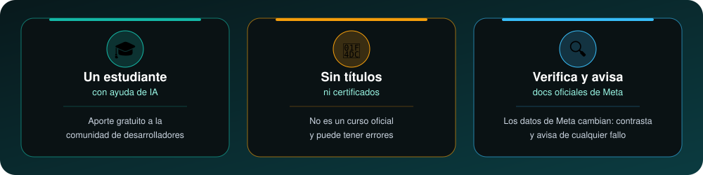

</div>

Contrasta los datos con la [documentación oficial de WhatsApp Business Platform](https://developers.facebook.com/docs/whatsapp/) y avísame de cualquier fallo en los [issues](https://github.com/Cacg-code/chatbots-whatsapp-desde-cero/issues/new).

📝 Lee también [lo que aprendí construyendo esto](https://cacg-code.github.io/chatbots-whatsapp-desde-cero/aprendizajes/): decisiones, errores reales y qué haría distinto.

## 📄 Licencia

<div align="center">


</div>

Código bajo [MIT](LICENSE); contenido bajo [LICENSE-CONTENIDO.md](LICENSE-CONTENIDO.md). Normas de convivencia en [CODE_OF_CONDUCT.md](CODE_OF_CONDUCT.md).

<div align="center">

<a href="https://github.com/Cacg-code/chatbots-whatsapp-desde-cero/issues/new"></a>

</div>
