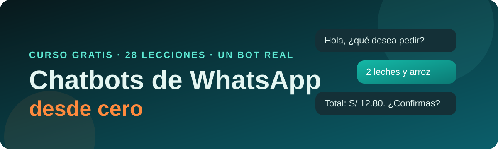

<div align="center">

<a href="https://cacg-code.github.io/chatbots-whatsapp-desde-cero/">
  
</a>


**Aprende a construir un bot de WhatsApp real, de la idea al despliegue, sin saber nada de bots.**
Se abre en el navegador, con ejercicios que se corrigen solos, simulador de chat y progreso guardado.

[**Entrar al curso**](https://cacg-code.github.io/chatbots-whatsapp-desde-cero/) · [**Probar el simulador**](https://cacg-code.github.io/chatbots-whatsapp-desde-cero/simulador/)

</div>

## Qué vas a construir

Un bot para un negocio ficticio, **Minimarket La Esquina**: muestra el catálogo, arma el carrito, toma el pedido (recojo o delivery, Yape o efectivo), guarda la sesión de cada cliente, avisa al dueño, envía recordatorios con plantillas y pasa a una persona cuando hace falta. La misma base sirve para citas, pedidos o preguntas frecuentes de cualquier negocio.

```text
Cliente (WhatsApp) -> webhook -> motor de reglas -> respuesta -> Cliente
                                      |
                              memoria (KV) + panel (Sheets)
```

## Temario (10 módulos, 28 lecciones y un proyecto)

| Módulo | Lecciones |
|---|---|
| Fundamentos | 1 Cómo funciona un bot · 2 Diseñar la conversación |
| Herramientas | 3 JavaScript y Node · 4 Primer bot en consola |
| Motor de reglas | 5 Estado · 6 Texto libre · 7 Catálogo y carrito · 8 Flujo de pedido |
| Servidor y webhook | 9 Webhooks y JSON · 10 Servidor del bot · 11 Despliegue en Cloudflare |
| Conectar con WhatsApp | 12 Cuenta y app de Meta · 13 Recibir mensajes · 14 Enviar mensajes · 27 Práctica con Telegram · 28 Otros proveedores |
| Memoria y datos | 15 Memoria con KV · 16 Panel con Google Sheets |
| Plantillas y automatización | 17 Plantillas · 18 Recordatorios · 19 WhatsApp Flows |
| Marketing y costos | 20 Marketing responsable · 21 Costos y métricas |
| Inteligencia artificial | 22 IA como complemento |
| Producción y negocio | 23 Pruebas y errores · 24 Seguridad · 25 Atención humana · 26 Vender tu bot |
| Proyecto final | El bot completo del minimarket |

## Antes de empezar

Necesitas lo básico de JavaScript. Si vienes de cero, haz primero [Desarrollo web desde cero](https://cacg-code.github.io/web-desde-cero/) (JavaScript y Node.js). Más trabajos del autor en el [portafolio Carlo · Dev](https://cacg-code.github.io/).

## Código de referencia

La carpeta [`codigo/`](codigo/) contiene el bot terminado, con 113 pruebas (`npm test`) y una consola para conversar con él (`node consola.js`). Las lecciones se escriben contra ese código real.

```bash
cd codigo
npm install
npm test
node consola.js
```

## Cómo está hecho

Las lecciones son Markdown en `contenido/`; `python scripts/construir.py` genera el sitio estático y `node scripts/probar-ejercicios.mjs` comprueba que cada ejercicio tiene una solución válida. `python scripts/revisar.py` valida enlaces, sitemap y accesibilidad básica.

## Aviso

Los datos de Meta (precios, límites, menús, versión de la API) cambian. Las lecciones lo marcan con «Verifica este dato» y enlazan a la documentación oficial. Este curso no está afiliado a Meta ni a WhatsApp.

## Licencia

Código bajo [MIT](LICENSE); contenido bajo [LICENSE-CONTENIDO.md](LICENSE-CONTENIDO.md). Normas de convivencia en [CODE_OF_CONDUCT.md](CODE_OF_CONDUCT.md).
